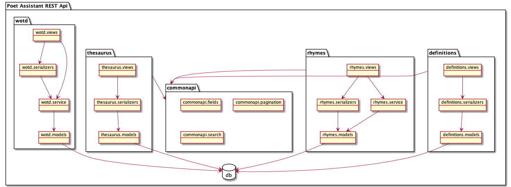

# poet-assistant-drf

Poet Assistant REST api using Django Rest Framework

[![GitHub license][license-image]][license-url]

[license-image]: https://img.shields.io/github/license/caarmen/poet-assistant-drf
[license-url]: https://raw.githubusercontent.com/caarmen/pylint-json2checkstyle/main/LICENSE

## Running

* Run the following commands:
    * `python3 -m venv env`
    * `source env/bin/activate`
    * `pip install -r requirements/dev.txt`
    * `python manage.py migrate`
    * `python manage.py runserver`
* Open the landing page at http://127.0.0.1:8000

## REST api documentation

See the [documentation](https://caarmen.github.io/poet-assistant-drf/) generated by openapi tools.

## Architecture

The app has the following architecture:

### Definitions and thesaurus entries

The endpoints for definitions and thesaurus entries are implemented using DRF Viewsets and
serializers and have logic limited to transforming the data as it's stored in the database into
the required format for the endpoint responses.

### Rhymes

The rhymes endpoint has a service layer to construct a complex raw SQL query to return the
rhymes for a word.

### Word of the day

The word of the day (wotd) endpoint has a service layer with some business logic:

- Minimal reimplementation of a random function, in order to have the same random results for
  a given seed as the word of the day feature provided by the
  [Android](https://github.com/caarmen/poet-assistant) and
  [iOS](https://github.com/caarmen/poet-assistant-ios) apps.
- Exclusion of too common or too rare words, based on a stem table in the database

### Common Api

Logic concerning pagination, search, and serialization, among the different endpoints, is
centralized in the commonapi package.
